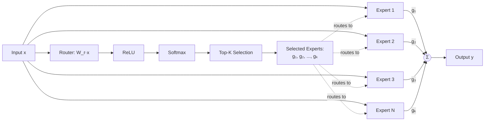

`` This is a Flowchart created to illustrate the code i have provided 🫡 ``

## Backpropagation in MoE (MSE Loss)

### Forward Pass

$$
y = \sum_{i \in \text{Top-K}} g_i \cdot E_i(x)
$$

$$
E_i(x) = W_{e_i} \cdot x
$$

$$
z = W_r \cdot x, \qquad h = \text{ReLU}(z), \qquad g = \text{Softmax}(h)
$$

### Backward Pass

**1. Loss Gradient (MSE)**

$$
\frac{\partial L}{\partial y} = 2(y - y_{\text{true}})
$$

**2. Gradient w.r.t Expert Outputs (Selected only)**

$$
\frac{\partial L}{\partial E_i} = g_i \cdot \frac{\partial L}{\partial y}
$$

**3. Gradient w.r.t Router Weights**

$$
\frac{\partial L}{\partial g_i} = E_i(x) \cdot \frac{\partial L}{\partial y}
$$

**4. Gradient through Softmax**

$$
\frac{\partial L}{\partial h_i} = g_i \cdot \left(\frac{\partial L}{\partial g_i} - \sum_j g_j \cdot \frac{\partial L}{\partial g_j}\right)
$$

**5. Gradient through ReLU**

$$
\frac{\partial L}{\partial z_i} = \frac{\partial L}{\partial h_i} \cdot \mathbb{1}[z_i > 0]
$$

**6. Gradient w.r.t Router Parameters**

$$
\frac{\partial L}{\partial W_r} = x^T \cdot \frac{\partial L}{\partial z}
$$

**7. Gradient w.r.t Expert Parameters (Selected only)**

$$
\frac{\partial L}{\partial W_{e_i}} = \left(g_i \cdot \frac{\partial L}{\partial y}\right) \cdot x^T
$$

**8. Gradient w.r.t Input**

$$
\frac{\partial L}{\partial x} = \sum_{i \in \text{Top-K}} g_i \cdot \frac{\partial L}{\partial y} \cdot W_{e_i} + \frac{\partial L}{\partial z} \cdot W_r^T
$$

---

### شكراً لكم جميعاً ❤️

**Mashary**
