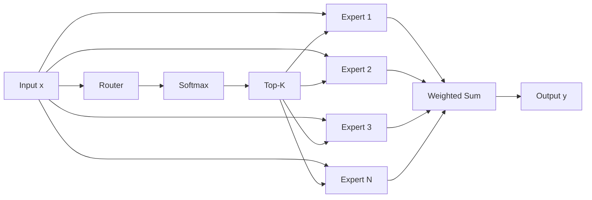
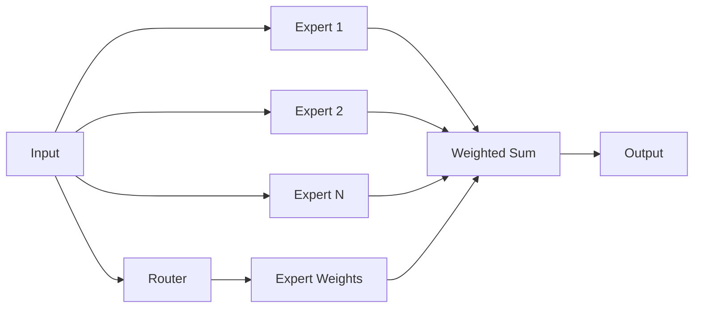
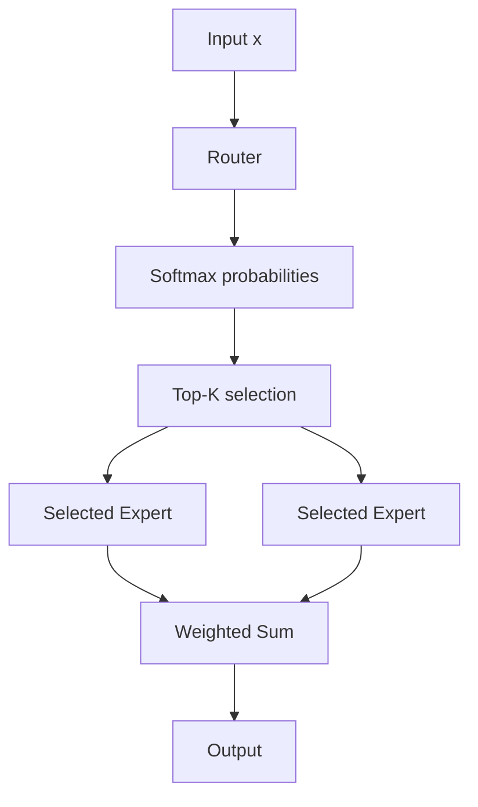
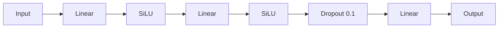
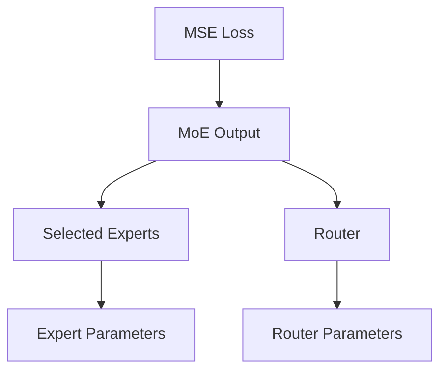
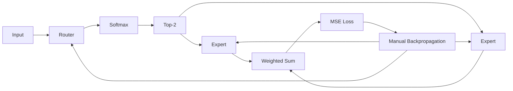
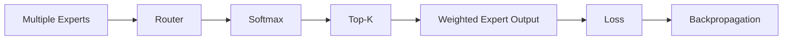

# Mixture of Experts 🥀 PyTorch & NumPy

A small **Mixture of Experts (MoE)** implementation built from scratch to understand how routing, experts, Top-K selection, and backpropagation work.

I implemented the idea in both **PyTorch** and **NumPy** while experimenting with a simple regression problem:

$$
y = 2x
$$

The project started with a normal MoE where every expert is used, then I added **Top-K routing** so only selected experts contribute to the output.

---

## How MoE Works

An MoE layer has two main parts:

* **Router** — decides which experts should handle the input.
* **Experts** — separate neural networks that process the input.

The basic idea is:



The router produces a probability for each expert:

$$
p = \text{Softmax}(W_rx+b_r)
$$

The selected experts are then combined:

$$
y =
\sum_{i \in TopK}
p_iE_i(x)
$$

---

# PyTorch Implementation

I implemented two versions.

## 1. Normal MoE

In the first version, **all experts are evaluated**.



The output is:

$$
y =
p_1E_1(x)
+
p_2E_2(x)
+
\cdots
+
p_NE_N(x)
$$

This version helped me understand the basic idea before adding sparse routing.

---

# 2. Top-K MoE

The second version selects only the best experts.

For example:

```python
model = MoE(
    1,
    8,
    1,
    4,
    2
)
```

This means:

```text
Input features : 1
Hidden size    : 8
Output features: 1
Experts        : 4
Top-K          : 2
```

The routing process is:



For example, the router could produce:

```text
Expert 1 → 0.10
Expert 2 → 0.55
Expert 3 → 0.05
Expert 4 → 0.30
```

With `topk = 2`:

```text
Expert 2 → selected
Expert 4 → selected
```

The selected values are normalized again before combining the outputs.

---

# Expert

Each PyTorch expert is a small MLP:



The actual implementation is:

```python
nn.Sequential(
    nn.Linear(infeatures, hidden_size),
    nn.SiLU(),
    nn.Linear(hidden_size, hidden_size),
    nn.SiLU(),
    nn.Dropout(0.1),
    nn.Linear(hidden_size, outfeatures)
)
```

Each expert has its own parameters.

---

# Router

The router is intentionally simple:

```python
class Router(nn.Module):
    def __init__(self, infeatures, n_experts):
        super().__init__()

        self.network = nn.Sequential(
            nn.Linear(infeatures, n_experts)
        )

    def forward(self, x):
        return nn.Softmax(dim=-1)(self.network(x))
```

Mathematically:

$$
z = W_rx+b_r
$$

$$
p = \text{Softmax}(z)
$$

So for `4` experts, the router produces `4` probabilities.

---

# Backpropagation

I also worked through how the gradients move through the MoE.

For:

$$
y =
\sum_{i \in TopK}
g_iE_i(x)
$$

and MSE loss:

$$
L =
\frac{1}{N}
\sum(y-\hat y)^2
$$

the gradient starts from the output:

$$
\frac{\partial L}{\partial y}
$$

and goes through both the **experts** and the **router**.



For an expert:

$$
\frac{\partial L}{\partial E_i}
===============================

g_i
\frac{\partial L}{\partial y}
$$

The router also receives gradients through the routing weights.

For Softmax:

$$
\frac{\partial L}{\partial z_i}
===============================

p_i
\left(
\frac{\partial L}{\partial p_i}
-------------------------------

\sum_j
p_j
\frac{\partial L}{\partial p_j}
\right)
$$

---

# NumPy Version

I also implemented a simpler version using NumPy.

The NumPy implementation does more of the work manually:



It includes:

* Router
* Softmax
* Top-2 selection
* Expert outputs
* MSE
* Manual gradients
* Parameter updates

The NumPy expert is simpler than the PyTorch expert and uses a linear layer with ReLU.

---

# Simple Experiment

The training example uses:

```python
x = torch.arange(0, 100).float().reshape(-1, 1)
y = x * 2
```

So the model learns:

$$
y = 2x
$$

Example:

```text
Input     Expected

10   →    20
20   →    40
30   →    60
40   →    80
50   →    100
```

After training, the Top-K model produces predictions close to:

```text
Predictions:
[20, 40, 60, 80, 100]

Expected:
[20, 40, 60, 80, 100]
```

I also save the selected experts:

```python
model.last_indices
```

so I can see which experts the router selected.

---

# PyTorch vs NumPy

|           | PyTorch          | NumPy                   |
| --------- | ---------------- | ----------------------- |
| Router    | Linear + Softmax | Manual Linear + Softmax |
| Experts   | MLP              | Linear + ReLU           |
| Routing   | Top-K            | Top-2                   |
| Gradients | Autograd         | Manual                  |
| Optimizer | Adam             | Manual update           |

---

# Installation

```bash
pip install torch numpy
```

---

# Basic Usage

```python
model = MoE(
    infeatures=1,
    hidden_size=8,
    outfeatures=1,
    n_experts=4,
    topk=2
)
```

Training:

```python
criterion = nn.MSELoss()
optimizer = torch.optim.Adam(
    model.parameters(),
    lr=1e-2
)

for epoch in range(5000):
    optimizer.zero_grad()

    y_hat = model(x)

    loss = criterion(y_hat, y)

    loss.backward()
    optimizer.step()
```

---

# What I Learned

This project helped me understand MoE from the inside rather than treating it as a black box.

The main things I worked through were:



The main idea is simple:

> **The router decides which experts should contribute, and the selected experts work together to produce the output.**

---

## Author

**Mashary** ❤️

Built from scratch while learning and experimenting with **Mixture of Experts, PyTorch, NumPy, routing, and backpropagation**.
